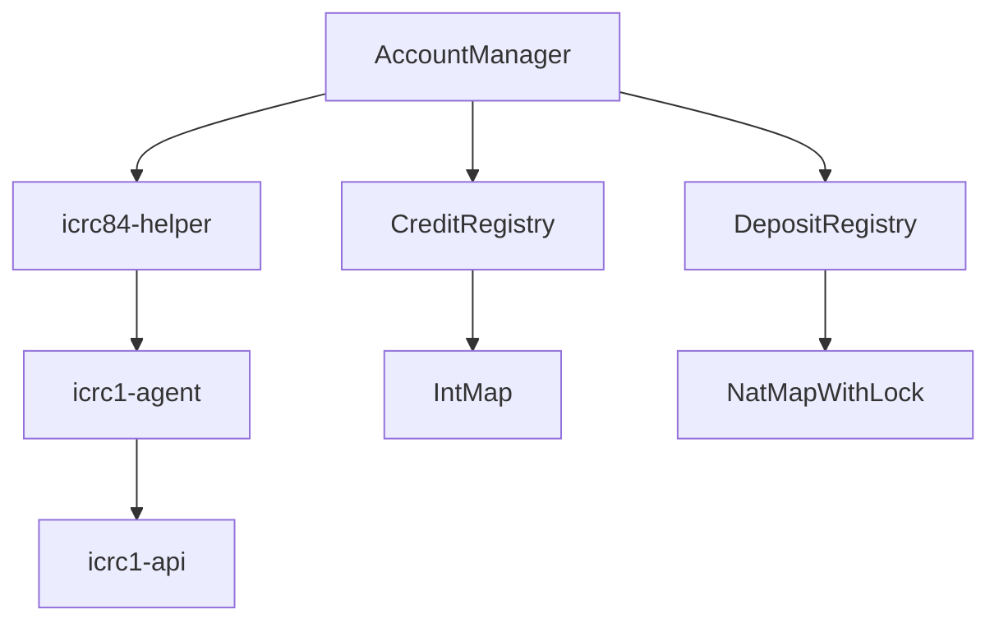

# TokenHandler


## Overview

TokenHandler is a comprehensive solution designed to facilitate the deposit and withdrawal management on an ICRC-1 ledger. The package allows financial service canisters to track and manage user funds efficiently and securely. An example for such a service is a DEX.

## Features

- Deposit via direct transfer
- Deposit via an allowance
- Withdrawal mechanism
- User balance tracking

## Links

The package is published on [MOPS](https://mops.one/token-handler) and [GitHub](https://github.com/research-ag/token-handler).

The API documentation can be found [here](https://mops.one/token-handler/docs/lib) on Mops.

For updates, help, questions, feedback and other requests related to this package join us on:

- [OpenChat group](https://oc.app/2zyqk-iqaaa-aaaar-anmra-cai)
- [Twitter](https://twitter.com/mr_research_ag)
- [Dfinity forum](https://forum.dfinity.org/)

## Build & test

We need up-to-date version of `mops` installed.

Then run:

```
git clone git@github.com:research-ag/token-handler.git
mops install
mops test
```

## Installation

You need `mops` installed. In your project directory run:

```
mops add token-handler
```

In the Motoko source file import the package as:

```
import TokenHandler "mo:token-handler";
```

## Example

To see token-handler package in action, check out the [example code](https://github.com/research-ag/token-handler/blob/main/example). The example is a simple implementation of the [ICRC-84](https://github.com/research-ag/icrc-84) standard.

## Documentation

### Requirements

The only requirement on the underlying token ledger is the ICRC-1 standard. Deposit method via direct transfer is available without ICRC-2 extension. For using the deposit method via an allowance ICRC-2 extension is required.

It is not required that the service can inspect individual deposit transactions by transaction id, memo or other means. Hence, it is not required that the underlying token ledger provides an indexer, transaction history or archive. In particular, the ICRC-3 extension is not required.

A service can also support multiple tokens, but to do this it has to operate separate TokenHandler instances for each supported token.

### TokenHandler options

| Property name | Type | Description |
| --- | --- | --- |
| ledgerApi | LedgerAPI | Object that represents the ledger API. |
| ownPrincipal | Principal | Service principal. |
| initialFee | Nat | Initial fee value. |
| triggerOnNotifications | Bool | Flag that enables scheduling consolidation after a deposit notification. |
| log | (Principal, LogEvent) -> () | Callback that is used to log events inside the token handler. |

### Fees processing

Fees are made up of two components: the surcharge and the ledger fee.

Depending on the operation, fees are calculated as follows:

| Operation | Fee value |
| --- | --- |
| Deposit via direct transfer | surcharge + ledger_fee |
| Deposit via an allowance | surcharge |
| Withdrawal from credit | surcharge + ledger_fee |
| Withdrawal from pool | ledger_fee |

The difference between the fee for a specific operation within TokenHandler (which is greater than the ledger fee due to the surcharge) and the ledger fee for transactions is a benefit for the service and it is sent to the pool.

### Deposit via direct transfer

Diagram representing the structural specifics of the deposit via direct transfer
The one of ways for a user to deposit funds to the service is via direct transfer to a so-called "deposit account" of the service. As part of this way, users make deposits into individual deposit accounts which are subaccounts that are derived from the user principal in a deterministic and publicly known way. Also this is balance-based method (as opposed to transaction-based). It means it is sufficient that the service can read the balances in the deposit accounts from the underlying token ledger.

There are two steps required when a user makes a deposit with the direct transfer method:

1. Make a transfer on the underlying ICRC-1 ledger into the individual deposit account under control of the service.
2. Notify the service about the fact that a deposit has been made.

After the user has made a transfer to the deposit account and notified the service, consolidation is scheduled. Consolidation is the process by which deposits are processed, that is, deposit funds are transferred from deposit accounts to the main account.

🔗 [Structure vizualisation](https://github.com/research-ag/token-handler/assets/154005444/9e3c81db-2671-44ab-ba10-9c37febdaed9)

🔗 [Sequence diagram](https://github.com/research-ag/token-handler/assets/154005444/6c165fda-ac79-440d-8460-7dfdd114f15f)

### Deposit via an allowance

Diagram representing the structural specifics of the deposit via an allowance

An alternative way to make deposits is via an allowance which is possible thanks to the standard ICRC-2. The standard extension specifies a way for an account owner to delegate token transfers to a third party on the owner's behalf.

There are two steps required when a user makes a deposit with the direct transfer method:

1. Approve an allowance to the service.
2. Call the deposit method with the desired amount.

Unlike deposit via direct transfer, deposit via an allowance allows to deposit in 1 step since there is no intermediate step with a deposit account. Accordingly, there is no consolidation and we only have one transfer within the deposit process. Allowances are simpler to process for the service, so overall transaction fees are lower.

But allowances due not always work, for example if:

- the ICRC-1 ledger does not support ICRC-2
- the user's wallet does not support ICRC-2 (currently most wallets)
- the user wants to make a deposit directly from an exchange

🔗 [Structure vizualisation](https://github.com/research-ag/token-handler/assets/154005444/34ab07eb-6594-4cd5-82c0-e14b9d41bebe)

🔗 [Sequence diagram](https://github.com/research-ag/token-handler/assets/154005444/584600ec-b35d-464d-b731-4d6b0825ec52)

## Withdrawal mechanism

The solution provides withdrawal functionality. It is carried out by a direct transfer from the main account to a specified arbitrary account. The integrity of balances is ensured as part of the withdrawal process. Thus, the solution provides a safe and reliable way to implement funds withdrawal from the service.

There are 2 types of withdrawals at the moment:

- from user’s balance
- from pool balance

🔗 [Sequence diagram](https://github.com/research-ag/token-handler/assets/154005444/b6f3d737-4635-46bf-b667-509cf228cd3a)

### API documentation

Full API documentation can be found [here](https://mops.one/token-handler/docs/lib).

## Implementation

We have the following modules:

|Module|Description|
|---|---|
|icrc1-api|ICRC1 type and interface definitions|
|icrc1-agent|Catches async errors, its functions never throw, simplified argument, no error inspection (pass-through), no retries|
|icrc84-helper|Easy access to subaccounts with embedded principal, amount arguments have their fee application "reversed", catches BadFee errors, tracks fee changes, stateless except for fee value, no retries|

Dependency graph:


## Copyright

MR Research AG, 2023-2024

## Authors

Timo Hanke (timohanke), Denys Kushnarov (reginleif888), Andy Gura (AndyGura)

## License

Apache-2.0
